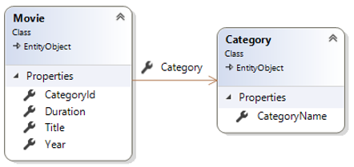

# Movie Manager WebApi (Teil 1)

## Lernziele

* EntityFramework Core
* UnitOfWork-Muster
* WebApi

## Core

Die Entitätsklassen sind bereits angelegt. Auch die Annotationen zur Definition (inkl. der Migrationen) der Datenbank sind bereits implementiert.

## Klassendiagramm

Die Klasse `Movie` verwaltet die Informationen zu einem konkreten Film inkl. dem Verweis auf die Kategorie (`Category`) des Films.

Im Core-Layer sind die Contracts für die Repositories bedarfsgerecht zu erweitern. Die leeren Interfaces sind bereits vorgegeben.

## Persistierung

Die Persistierung besteht bereits und ist im Projekt `MovieManager.Persistence` implementiert.

## Import

Die Logik zum Einlesen der Movies (inkl. Categories) ist bereits im Projekt `MovieManager.ImportConsole` implementiert.

## WebApi

Implementieren Sie zur bestehenden Persistenzschicht eine WebApi analog zum [Live-Coding](https://github.com/jfuerlinger/csharp_livecoding_ef_uow_webapi-part1/tree/master).

Ihre WebApi sollte zumdindest folgende Aufrufe unterstützen:

1. Abfrage aller Kategorien (Sortierung: Namen aufsteigend)
2. Abfrage aller Filme einer Kategorie (z.B.: Action) (Sortierung: Name aufsteigend)
3. Abfrage aller Filme inkl. Kategorie (Sortierung: Erscheinungsjahr absteigend, danach nach Filmtitel aufsteigend)
4. Abfrage aller Kategorien inkl. durchschnittlicher Filmdauer, Gesamtdauer aller Filme und die Anzahl der Filme.  Sortiert nach Anzahl der Film absteigend

Verwenden Sie dazu das die Visual Studio Code Extension [REST Client](https://marketplace.visualstudio.com/items?itemName=humao.rest-client).

Es gibt bereits eine Datei `rest.http` mit den entsprechenden Anforderungen als Kommentar.